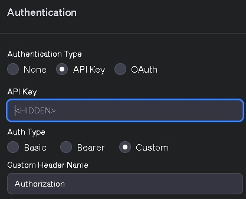

# ClubGPT - CommandProxy
```
          =*##*=              
        -@@@@@@@@-            
        @@@@@@@@@@            
        %@@@@@@@@%             .g8"""bgd `7MM            *MM          .g8"bgd `7MM""Mq. MMP"MM"YMM
   .---:.#@@@@@@%.:---.      .dP'     `M   MM             MM        .dP'   `M   MM  `MM.P'  MM  `7
 -%@@@@@@*#@@@@#*@@@@@@%=    dM'       `   MM `7MM  `7MM  MM,dMMb.  dM'     `   MM  ,M9     MM 
-@@@@@@@@@@@@@@@@@@@@@@@@=   MM            MM   MM    MM  MM    `Mb MM          MMmdM9      MM 
=@@@@@@@@@@@@@@@@@@@@@@@@+   MM.           MM   MM    MM  MM     M8 MM.  `7MMF' MM          MM     
 *@@@@@@@@++@@*+@@@@@@@@*    `Mb.     ,'   MM   MM    MM  MM.   ,M9 `Mb.   MM   MM          MM      
  .=***=: .@@@@. :=***=.       `"bmmmd'  .JMML. `Mbod"YML.P^YbmdP'    `"bmdPY .JMML.      .JMML.    
          #@@@@%             
         *@@@@@@#             
        =#**++***=            
```
An OpenAPI 3.1 compatible service which enables ChatGPT / GPTs to run commands as an action on any computer (powershell, bash etc.). Basically you can run tasks your computer remotely with natural language prompts.

Use at you own risk.

# Members of the ClubGPT agent tool/family
## GPT Agent group prompts (this repo)
- [♣️ ClubGPT ♣️ - DevTeam](https://github.com/matebenyovszky/ClubGPT) - It's a think tank, coding companion, a developer team in one GPT
- [♣️ ClubGPT ♣️ - DreamTeam](https://github.com/matebenyovszky/ClubGPT) - amore general approach, where the AI selects team members and tools according to the task

## Workshop and tools for the agents (other repos)
- ♣️ ClubGPT ♣️ - CommandProxy - (this repo) run commands and code on a remote computer
- ♣️ ClubGPT ♣️ - Sandbox - run code in a sandbox
- [♣️ ClubGPT ♣️ - Sandbox-ts](https://github.com/matebenyovszky/ClubGPT-Sandbox-ts) - run code in a sandbox (in Typescript, I possibly will continue to work on the Python version)

## Introduction

Using this tool and having ChatGPT Plus you can run any shell commands on your computer as an action.

There are of course other approaches using local language models or LLM APIs, running them locally (like [Open Interpreter](https://github.com/KillianLucas/open-interpreter) or [PowerShellAI](https://github.com/dfinke/PowerShellAI)) or on a remote sandbox (like [ClubGPT-Sandbox](https://github.com/matebenyovszky/ClubGPT-Sandbox)), which are all also cool, but I wanted to try how far can I go with this approach.

## Fetures and highlights

- This is a Flask API that allows executing commands on a machine (PowerShell/CMD/Shell/Bash/Python etc.).
- It uses an API key for authorization (fixed or generated for every session - so you don't expose your machine to ChatGPT on a long term)
- Separate endpoint to get basic data about the system (/system_info)
- Bridge mode to forward request to another worker. Bridge mode was required because I cannot make it work directly with ChatGPT, so I made az Azure Web App to forward commands.

## Samples and ideas

- File and Folder Management:
  - Create a folder in one location, then move files to it from another location.
  - Find and copy or delete multiple files from the machine based on various filter criteria (e.g. extension, creation date).
- Collect system information:
  - Query system hardware and software configuration, such as processor, memory, operating system version.
- Automated Administrator Tasks:
  - Analyze system log files, look for error messages or specific events.
  - Configure or update remote desktop settings.
- Perform network operations:
  - Display the IP address and network configuration of the machine.
  - Run network diagnostic commands such as ping or traceroute.
- Scripts and Automated Tasks:
  - Write and run simple Python or PowerShell scripts, for example for data processing or system administration.
- Security Audits:
  - Checking and installing security updates.
  - Run virus scans or check firewall settings.
- Custom Tasks:
  - Set automated reminders or alerts for special events.
  - Install, update or uninstall various applications via command line.

Some sample pictures

[View Sample Images Here](images/)

## Setup

1. Install the required Python packages:
pip install -r requirements.txt

2. Configuration

- CP_MODE options:
 - SERVER: a worker (executor) that can run commands, could also act as a bridge
 - BRIDGE: cannot execute commands in the environment, just forward them. This is the default.

- KEY_MODE options
 - ENV_KEY: API key defined in the .env file.
 - SESSION_KEY: Random key every time you. This is the default.

3. Run the application:
python app.py

4. Maker you machine accessible from the internet, accessible by ChatGPT.

In my case I've set up a Dynamic DNS with Let's Encrypt certificates and port forwarding in my computer (published my computer's port 5000 on 443). Downloaded key.pem and cert.pem from the router into "certificates" directory so I could start my Flask application with those.

5. Create a GPT

You can use this [prompt](prompts.example.md) as an instruction, where if you optionally set the base data you can start quicker.

6. Add GPT action

Create new action, import URL from your server `https://%URL%/apispec.json`.
Set Authentication to "API Key" with header name "Authorization".



7. Have fun

## Usage from API calls

You can execute a command on the server by making a POST request to the `/execute` endpoint. Here's a sample `curl` command:

```bash
curl -X POST "%URL%/execute" -H "Authorization: your_secret_api_key_here" -H "Content-Type: application/json" -d '{"command":"ls"}'
```

```powershell
# API URL
$url = '%URL%/system_info'

# API Key
$headers = @{"Authorization" = "your_secret_api_key_here"}

$body = @{
    #"serverAddress" = "optional_remote_%URL%"
    #"serverAPIkey" = "optional_remote_your_secret_api_key_here"

} | ConvertTo-Json

# Send GET Request
$response = Invoke-RestMethod -Uri $url -Method Post -Headers $headers -Body $body -ContentType "application/json"

# Display the Response
$response
#$response.stdout # If JSON
```

```powershell
# API URL
$url = '%URL%/execute'

# API Key
$headers = @{"Authorization" = "your_secret_api_key_here"}

# Data Payload
$body = @{
    "command" = "echo Hello World!"
    #"serverAddress" = "optional_remote_%URL%"
    #"serverAPIkey" = "optional_remote_your_secret_api_key_here"

} | ConvertTo-Json

# [System.Net.ServicePointManager]::ServerCertificateValidationCallback = { $true }

# Send POST Request
$response = Invoke-RestMethod -Uri $url -Method Post -Headers $headers -Body $body -ContentType "application/json"

# Display the Response
$response
#$response.stdout # If JSON
```

Replace `your_secret_api_key_here` with your actual API key.

## Security

This API uses an API key for authorization. The API key is set in the environment variable `API_KEY`. If `API_KEY` is not set, the application will generate one.

But be aware, that this is only a POC, can be considered as a backdoor to your machine, not intended for production etc... so use at your own risk.

### Contributions

Contributions are welcome! Submit a pull request with any improvements or bug fixes.

### License

This project is licensed under Attribution-NonCommercial-ShareAlike 4.0 International License - see the [LICENSE.md](LICENSE.md) file for details.